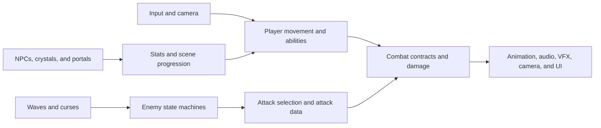
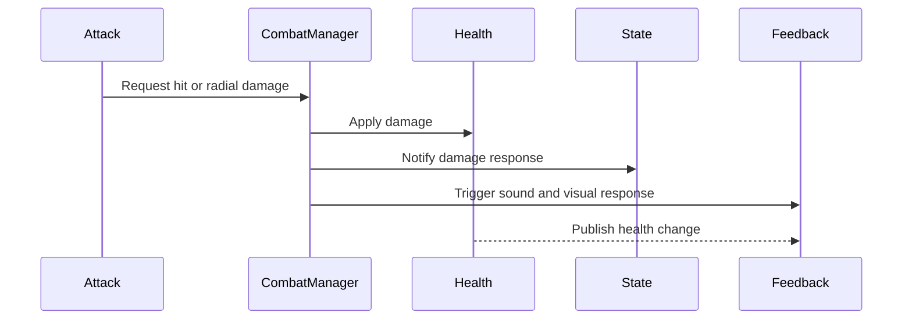

# CyberVeil Architecture

## Overview

CyberVeil is organized around focused Unity components, reusable behavioral interfaces, C# events, serialized scene relationships, and ScriptableObject attack data. The architecture favors explicit components over a single global gameplay manager.



## Runtime areas

| Area | Namespace | Responsibilities |
| --- | --- | --- |
| Core | `CyberVeil.Core` | Character state infrastructure, faction data, animation coordination, and interaction contracts |
| Combat | `CyberVeil.Combat` | Health, damage, knockback, damage-state responses, and combat coordination |
| Player | `CyberVeil.Player` | Movement, camera, attacks, sprint, dash, Veil Surge, interaction, and stat upgrades |
| Enemies | `CyberVeil.Enemies` | Enemy state behavior, attack selection, attacks, projectiles, shields, and damage response |
| Systems | `CyberVeil.Systems` | Waves, curses, scene progression, shared player reference, camera feedback, audio, tutorials, and pooling |
| UI | `CyberVeil.UI` | HUD, menus, dialogue, prompts, tutorial presentation, death flow, and archive navigation |
| VFX | `CyberVeil.VFX` | Damage visuals, dissolves, player particles, and pooled particle playback |
| World | `CyberVeil.World` | NPCs, healing crystals, portals, upgrades, and world interaction |

## Combat contracts

Combat behavior is separated through interfaces:

- `IDamagable` receives damage.
- `IKnockbackable` receives knockback.
- `IDamageStateResponder` transitions a character into its damage response.
- `IDamageVisual` handles visual damage feedback.
- `IDamageSound` handles damage audio.
- `IEnemyAttack` provides a common enemy-attack execution contract.
- `IAttackEffect` lets an attack trigger optional presentation independently of damage logic.



This allows the player and different enemies to share damage infrastructure while retaining character-specific state, animation, audio, and VFX behavior.

## Player flow

The player is composed from focused components:

- `Player Controllerr.cs` handles core locomotion.
- `OmniDirectionalCam.cs` provides camera-relative behavior.
- `PlayerAttack.cs` coordinates attacks.
- `AttackLimiterMechanic.cs` controls attack availability.
- `PlayerSprint.cs` and `PlayerDash.cs` own their movement abilities.
- `VeilSurgeSkill.cs` owns Veil Surge state.
- `PlayerInteractor.cs` communicates through interaction contracts.
- `PlayerStatsUpgradeManager.cs` owns upgradeable statistics.

Dash cooldown, attack charge, health, and stat components publish events so presentation can react without gameplay components directly owning the HUD.

## Enemy flow

`EnemyAIController` coordinates enemy behavior using state-oriented components such as patrol, chase, and damaged states.

Enemy attacks are data-driven:

1. `EnemyAttackSelector` evaluates configured attacks.
2. `EnemyAttackData` ScriptableObjects define range, cooldown, animation, duration, and attack prefab.
3. Attack prefabs implement `IEnemyAttack`.
4. `CombatManager` applies shared combat rules.

Projectile attacks use `RuntimeObjectPool`. Other attack wrappers retain normal Unity lifetime because measurement did not justify expanding their lifecycle complexity.

## Waves, curses, and progression

`WaveManager` coordinates encounters and publishes:

- `OnWaveStarted`
- `OnWaveCleared`
- `OnUpgradePhaseStarted`

`TrialCurseModifier` publishes curse application and clearing events. UI and other systems react without being embedded directly in the wave manager.

`SceneProgressManager` manages the enabled build flow:

1. `CyberVeil_HomeScreen`
2. `CyberVeil_Level1`
3. `CyberVeil_Level2`
4. `CyberVeil_Level3`

`ScreenFadeManager` provides transition presentation, while upgrade portals and other world interactions initiate progression through explicit gameplay components.

## Interaction model

World interactions use `IInteractable` and `IInteractor`. Implementations include NPCs, healing crystals, upgrade portals, and player interaction detection. This avoids special-case player code for each world object.

## Feedback architecture

Combat readability is distributed across specialized systems:

- `CharacterAnimationController` for animation coordination
- `HitStopManager` for impact timing
- `ScreenShake` for camera response
- `SoundManager` and damage-sound components for audio
- `ParticleManager` for reusable particle effects
- `DissolveEffectHandler` and damage visual components for shader-driven feedback
- HUD components for health, attacks, curses, tutorials, and prompts

Gameplay remains authoritative; presentation reacts through interfaces, events, or serialized references.

## Object lifetime

Most scene-owned objects follow normal Unity scene lifetime. Short-lived enemy projectiles use a scene-local pool:

- Pools are keyed by source prefab.
- Instances are prewarmed and expand when exhausted.
- Returned instances reset physics, colliders, renderers, particles, trails, animation, audio, coroutines, ownership, damage, and timers.
- Pool roots are destroyed with their scene, preventing cross-level references.

Enemies and healing crystals are not pooled because their destruction participates in wave progress and reward behavior.

## Design tradeoffs

- Interfaces are used where multiple systems share a behavioral contract.
- Events are used for one-to-many notifications such as wave, health, cooldown, and upgrade changes.
- Serialized references are used for required, scene-specific relationships.
- ScriptableObjects provide reusable enemy attack configuration.
- Direct local references are preferred when abstraction would not reduce coupling.

The architecture is intentionally pragmatic: systems are separated where reuse or independent feedback matters, while small one-off behaviors remain simple components.

## Repository map

```text
Assets/
|-- Art/                    Models, materials, animations, shaders, textures, and UI art
|-- Audio/                  Music and sound effects
|-- Scenes/                 Home screen and three playable levels
\-- Scripts/
    |-- Audio/              Audio-facing components and contracts
    |-- Combat/             Damage, health, knockback, and combat coordination
    |-- Core/               Shared state and interaction contracts
    |-- Enemies/            Enemy states, attacks, projectiles, and responses
    |-- Player Scripts/     Player movement, combat, abilities, and progression
    |-- Systems/            Waves, curses, scenes, feedback, and pooling
    |-- UI/                 Menus, HUD, dialogue, tutorials, and prompts
    |-- VFX/                Particles, dissolves, and damage visuals
    \-- World/              NPCs, crystals, portals, and world interactions
```
